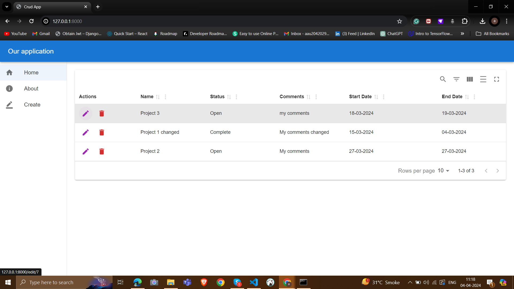

# Crud App

Imagine a versatile tool designed to streamline your project management process—that's exactly what this CRUD (Create, Read, Update, Delete) App is all about. Picture a sleek interface where you can effortlessly create new projects, track their progress, and manage their details with ease. From a simple homepage displaying a neat list of projects, complete with their due dates and current statuses, to functionalities allowing you to edit or remove projects as needed.

Built with the powerful combination of Django and React.js, this app isn't just about functionality—it's a learning experience. Whether you're delving into the basics of project management or exploring the integration of Django and React.js, this app serves as your hands-on guide. So, dive in, explore, and elevate your understanding of project management and web development in one go.

## Preview


## Demo

link to demo
(https://screenrec.com/share/4Gw3fsCcKn)
## Installation

Install my-project with npm

```bash
  npm create-react-app
```
```bash
list of npm package installed:

├── @emotion/react@11.11.4
├── @emotion/styled@11.11.0
├── @hookform/resolvers@3.3.4
├── @mui/icons-material@5.15.13
├── @mui/material@5.15.13
├── @mui/x-date-pickers@6.19.7
├── @testing-library/jest-dom@5.17.0
├── @testing-library/react@13.4.0
├── @testing-library/user-event@13.5.0
├── axios@1.6.7
├── dayjs@1.11.10
├── material-react-table@2.12.1
├── react-dom@18.2.0
├── react-hook-form@7.51.0
├── react-router-dom@6.22.3
├── react-scripts@5.0.1
├── react@18.2.0
├── web-vitals@2.1.4
└── yup@1.4.0
```
Install requirment python package:
```bash

    asgiref==3.7.2
    backports.zoneinfo==0.2.1
    Django==4.2.11
    django-cors-headers==4.3.1
    djangorestframework==3.14.0
    psycopg2==2.9.9
    pytz==2024.1
    sqlparse==0.4.4
    typing-extensions==4.10.0
    tzdata==2024.1
```
## From Setup to Deployment

First is to setup Backend and Frontend below is steps:

```bash
  create a folder
```
```bash
  create one folder name BE in that.
```
```bash
  setup venv for BE using cmd:

  python -m venv {name_env}
```
```bash
  install requirment package:
    asgiref==3.7.2
    backports.zoneinfo==0.2.1
    Django==4.2.11
    django-cors-headers==4.3.1
    djangorestframework==3.14.0
    psycopg2==2.9.9
    pytz==2024.1
    sqlparse==0.4.4
    typing-extensions==4.10.0
    tzdata==2024.1
```
```bash
  now in the main folder create FE folder by cmd:
  npx create-react-app {name_of_folder_for_forntend}
```
```bash
  So now you will have two folder in the main folder
```
```bash
  after completing setup now we need BE (Django) url to give allow the permission to use when integrating with FE (Reactjs):

  install in python env -- django-cors-headers

  in settings.py of your project name:
  add in INSTALL_APPS --- " 'corsheaders', " 
  add in MIDDELEWARE --- "'corsheaders.middleware.CorsMiddleware',"
  and at end of file add " CORS_ALLOW_ALL_ORIGINS = True"
```

To deploy this project to run in same local host.

```bash
  After complete of Frontend integrated with Backend we will run this cmd in frontend directory.

  --- npm run build
```
```bash
    then after build is complete now copy the frontend folder and paste in backend folder 
```
```bash
  now go to setting.py in django go to 'TEMPLATES' wirte:

  'DIRS': [BASE_DIR / '{name_of_FE_folder}/build'],
```
```bash
  scroll down in setting.py and create name "STATICFILES_DIRS" below "STATIC_URL" like this:

  STATICFILES_DIRS = [
    BASE_DIR / 'frontend/build/static'
]
```
```bash
  after mapped build and static go urls.py of main django folder and us template view :

  from django.views.generic import TemplateView

urlpatterns = [
    path('admin/', admin.site.urls),
    path('api/', include('api.urls')),
    path('',TemplateView.as_view(template_name='index.html')) ---> write your html of FE in here 
]

```
```bash
so now when you run your django server both react ad Django will work in same localhost.
```

## Authors

- [@NickMol](https://github.com/NickMol/Django-React-Tutorial) (For Referance)

- https://www.youtube.com/@CBIAnalytics (also check his youtube channel)


## Acknowledgements

- [Follow for more like this on youtube ](https://www.youtube.com/@CBIAnalytics)


## Best of tools to go throught for Ract UI

MeterialUI: it is best tool for ui and get codes for react.

React hook form: it is another tool which we can use less code and more stablity.

Recharts: for varity charts

material react table: for varity of tables

Nivo: for varity charts
